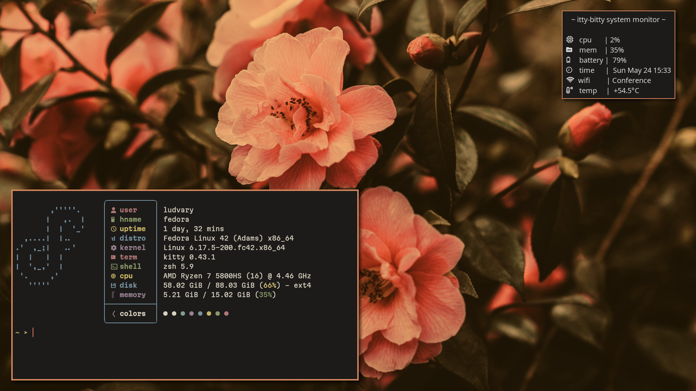
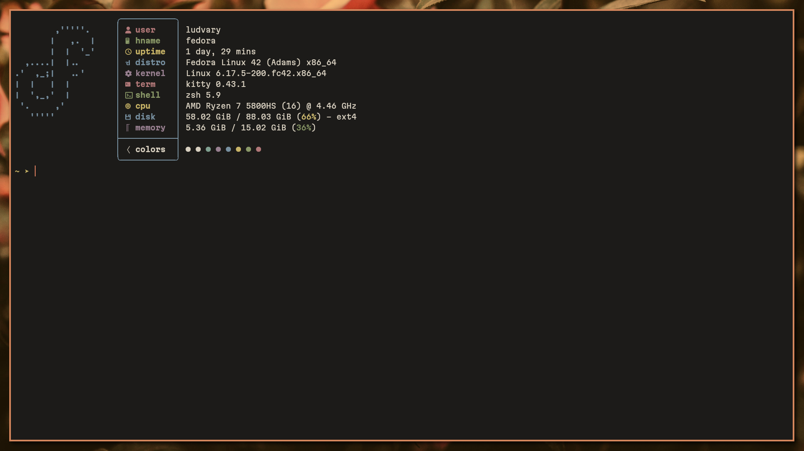
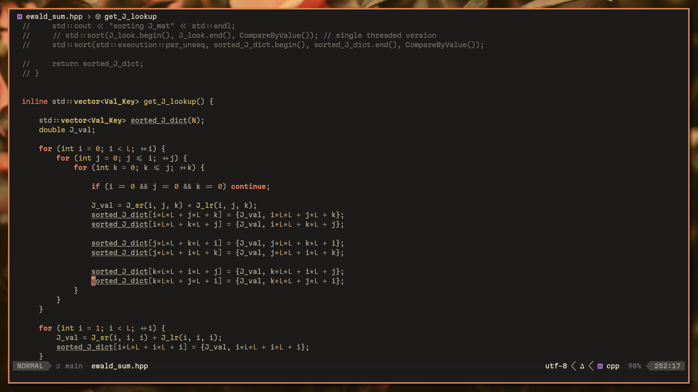
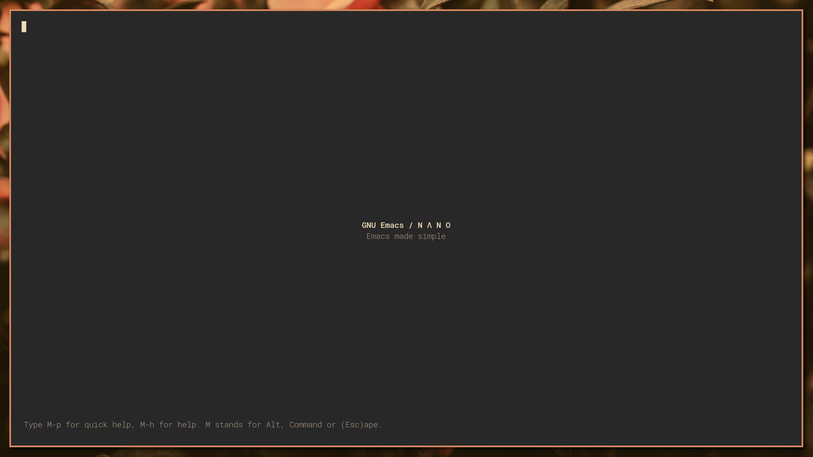
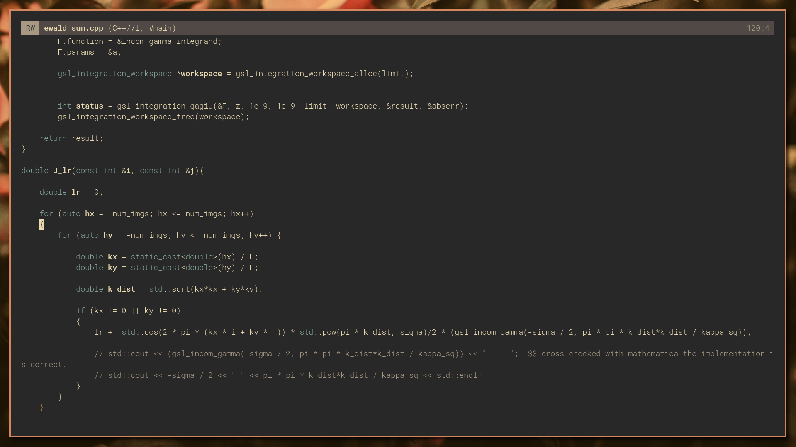
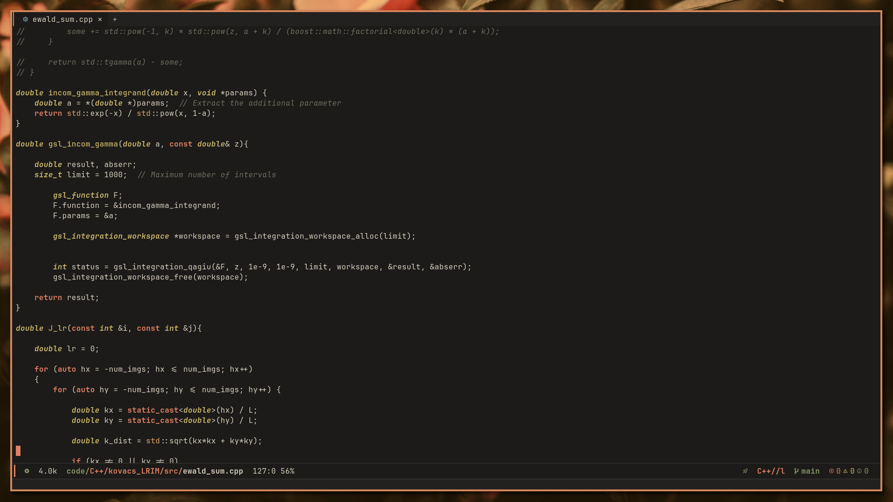
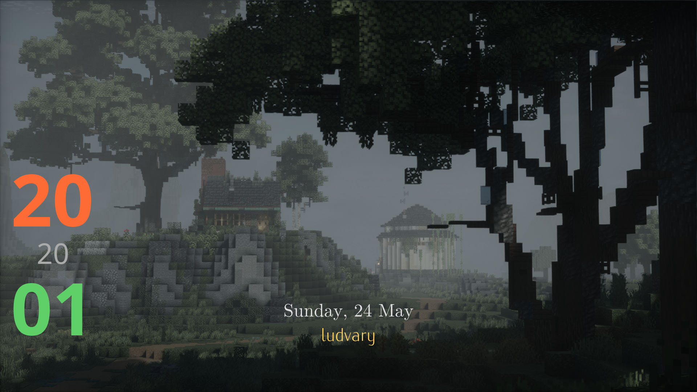

## my i3 dots

---

### Desktop

  
   
  <i></i>

---

### Kitty

  
   

---

###  Neovim

  
   

---

### Nano Emacs

  
  
   

---

### Doom Emacs

  
   

---

### Lockscreen

  
   
  <i>using i3lock-color and some eww widgets</i>

